<div align="center">

</div>


# Editax

Editax is a framework for creating automated ACCEL editors for Unsupervised Environment Design. Its primary goal is to generate and refine modifications to reinforcement learning (RL) environments automatically. By leveraging advanced language models and minimal meaningful perturbation strategies, Editax provides a scalable way to design environments that both ease agents into training and continuously challenge them as they progress.


## Motivation

Designing effective RL environments is crucial for training robust, adaptable agents. Traditional methods require considerable manual effort and iterative fine-tuning, which can slow down research and development. Editax addresses these challenges by:

- **Automating Editor Creation:** Uses ACCEL (Adversarially Compounding Complexity by Editing Levels) techniques to automatically generate and correct environment modifications.
- **Accelerating Experimentation:** Enables rapid prototyping of environment changes without manual intervention.
- **Enhancing Unsupervised Design:** Applies unsupervised methods to derive minimal meaningful perturbations that gradually adjust the difficulty of the environment.

This automated approach allows researchers and practitioners to experiment with environment designs more effectively and efficiently.

## Getting Started with Poetry

Poetry is used to manage dependencies and package building in the Editax ecosystem. It simplifies the process of generating and integrating environment editors, streamlining the creation, testing, and correction of editor functions.

### Local Setup

Follow these steps to set up Editax locally:

1. **Clone the Repository:**
   ```bash
   git clone https://github.com/yourusername/editax.git
   ```

2. **Navigate to the Repository Directory:**
   ```bash
   cd editax
   ```

3. **Install Dependencies with Poetry:**
   ```bash
   poetry install
   ```

4. **Set Up Environment Variables:**
   Ensure that API keys for your chosen language model are set (e.g., `OPENAI_API_KEY`, `ANTHROPIC_API_KEY`, or `DEEPSEEK_API_KEY`).

### Running the Editor Generator

To start the automated editor generation, run:

```bash
python -m experiments.gen_editors_kinetix
```

This command will:
- Load the target RL environment source code
- Generate candidate editor functions based on the ACCEL approach
- Iteratively apply corrections and refinements to produce a robust and functioning set of environment modifications

## Contributing

Contributions to Editax are welcome! If you have suggestions, improvements, or bug fixes, please open an issue or submit a pull request on our GitHub repository.

## License

Editax is licensed under the Apache License, Version 2.0. See the [LICENSE](LICENSE) file for details.

## References

[1] Parker-Holder, J., Jiang, M., Dennis, M., Samvelyan, M., Foerster, J., Grefenstette, E., & Rocktäschel, T. (2022). [Evolving Curricula with Regret-Based Environment Design](https://arxiv.org/abs/2203.01302). arXiv preprint arXiv:2203.01302.

[2] Matthews, M., Beukman, M., Lu, C., & Foerster, J. (2024). [Kinetix: Investigating the Training of General Agents through Open-Ended Physics-Based Control Tasks](https://arxiv.org/abs/2410.23208). arXiv preprint arXiv:2410.23208.

[3] Coward, S., Beukman, M., & Foerster, J. (2024). [JaxUED: A simple and useable UED library in Jax](https://arxiv.org/abs/2403.13091). arXiv preprint arXiv:2403.13091.

[4] Matthews, M., Beukman, M., Ellis, B., Samvelyan, M., Jackson, M., Coward, S., & Foerster, J. (2024). [Craftax: A Lightning-Fast Benchmark for Open-Ended Reinforcement Learning](https://arxiv.org/abs/2402.16801). arXiv preprint arXiv:2402.16801.

[5] Jiang, M., Dennis, M., Parker-Holder, J., Foerster, J., Grefenstette, E., & Rocktäschel, T. (2023). [Minimax Regret Environment Design for Open-Ended Learning](https://arxiv.org/abs/2311.12716). arXiv preprint arXiv:2311.12716.
